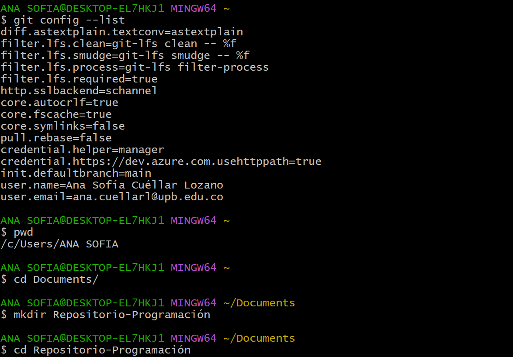

# Uso de la consola y el navegador.

Para manejar Git se necesita familiarizarse con varias cosas de la consola

Como por ejemplo, al momento de utilizar la consola por primera vez debemos hacer una configuración inicial con los comandos:

   git config --global user.name "Nombre Completo"
   git config --global user.email "Email"

Después de realizada la configuración podemos ver en que lado de los documentos estamos ubicados con el comando **pwd**
una vez sabemos donde estamos, si queremos cambiar de ubicación debemos ingresar en la cosola  el comando:
**cd nombre exacto de la carpeta a la que queremos dirigirnos** o bien crear una carpeta con el comando: 
**mkdir nombre de la carpeta que queremos crear** una vez creada la carpeta podemos dirigirnos a la misma usando el comando
antes especificado;para ver que contiene la carpeta debemos ingresar el comando **ls**, si queremos convertir esa carpeta en
un repositorio debemos ingresar el comando **git init** eso creará una carpeta oculta *.git*.

Para crear un archivo podemos usar el comando **touch nombre del archivo.extención**. Una vez creado un archivo, para editarlo podemos realizar dos opciones:

- Si queremos visualizarlo en el editor de la consola debemos ingresar el comando **vim nombre del archivo.extención**

Ó

- Si queremos visualizarlo en Microsoft Visual Studio debemos ingresar el comando **code .**

Al momento de terminada la edicion de la consola si queremos guardar un commit debemos usar el comando:
**git add nombre del archivo** Esto deja los cambios realizados en una especie de "borrador" para realizaer el checkpoint.

Para realizar el checkpoint debemos realizar el comando **git commit -m nombre del checkpoint** Esto creara el checkpoint.
Sin embargo, estan en una rama aledaña, para pasarlos a la rama principal se deben realizar los comandos:

- **git log**

- **git log -oneline**

En resumen los comandos principales son:
-

- **git config --globalgit config --global**

- **git config --global user.email "Email"**

- **pwd**

- **cd**

- **ls**

- **mkdir**

- **git init**

- **touch**

- **vim**

- **code .**

- **git add**

- **git commit -m**

- **git log**

- **git log -oneline**
